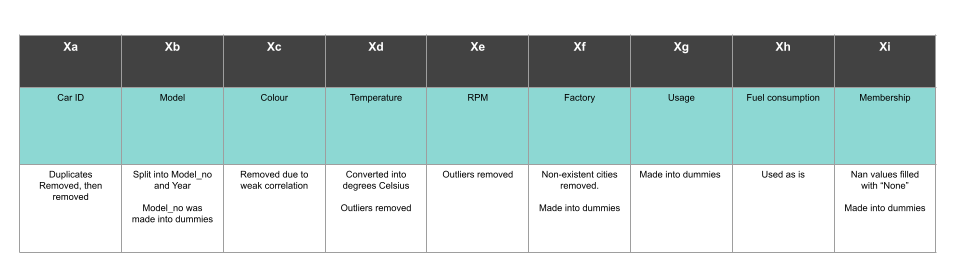

# End-to-end pipeline to predict occurence of car failures

This project is a end to end pipeline, which can be executed to make predictions of car failures based of a test set pulled out from a database.<br>
<br>
This repository contains:<br>
* src folder (contains .py scripts)
* img folder (contains images for README.md)
* eda.ipynb
* requirements.txt
* run.sh
* <strong>There is no data folder, please load in your data folder</strong>

# Executing pipeline
The pipeline can be executed by running the run.sh file (tested on MacOS)<br>
The executed pipeline will give you a prediction of car failures on 20% of the set

```
./run.sh
```

The pipeline has 3 inbuilt machine learning algorithms:<br>
* Logistic Regression<br>
* Random Forest Classifier<br>
* XGBoost Classifier (Best results, but slow)<br>
<br>
When run, the pipeline was supposed prompt the user to input a chosen algorithm.<br>
Regretably doing that causes the run.sh to fail in github<br>
The algorithm could have been be chosen by inputting:<br>

```
lr
```

^ for Logistic Regression
<br>
<br>
```
rf
```

^ for Random Forest Classifier
<br>
<br>
```
xbg
```

^ for XGBoost Classifier <br>
<br>
The model self-optimises for best hyperparameters
<br>

# Pipeline flow<br>
The pipeline flow involves the following steps in order<br>
1. importing libraries
2. prompt user to select ML model
3. SQL query to retrieve database and convert into DataFrame
4. Handling NaN values
5. Removing duplicates
6. Unit Conversion
7. Handling / removing outliers
8. Creating dummies
9. Creating train and test datasets
10. Scaling and Upsampling datasets
11. Running ML model
12. Optimise ML model gridsearchCV
13. Produce optimised predictions

# EDA key findings<br>
The key findings are:<br>
The data contains Nan values, duplicates, wrong units, extreme outliers, and data from non-exsistent cities<br>
* Pipeline involves data cleaning to solve the data<br>
<br>
Data is unbalanced, and has different scales in different features<br>

* Pipeline involves upsampling<br>
* Pipeline involves MinMaxScaling<br>
<br>
Not all features are correlated to car failure<br>

* Features with weak correaltion to car failure, such as car color, are removed<br>
<br>


# Feature Processing



# Model choice

The predition is a classification problem<br>

* Classification Models are used<br>
* Logistic Regression is used as a baseline due to its fast prediction speed<br>
* Random Forest Classification is used as they tend to be better for categorical data than Logistic Regression<br>
* XGBoost Classifier was chosen due to the unbalanced dataset, as XGBoost increases weightage of the minority samples to account for the lack of balance<br>
* GridSearchCV used to optimise the above models<br>

# Model Evaluation
* f1-score and recall are the most important metrics used to evaluate how accurately the model can predict true postivies, especially in a unbalanced dadtaset<br>
* XGBoost Classifier found to be the best model, with best f1-score, best recall, and most true positives predicted in all 5 faults in general<br>
* Nonetheless, the performance for all 3 models are disappointing, and future work can involve more model types and approaches, such as K Nearest Neighbours, to improve on model accuracy
